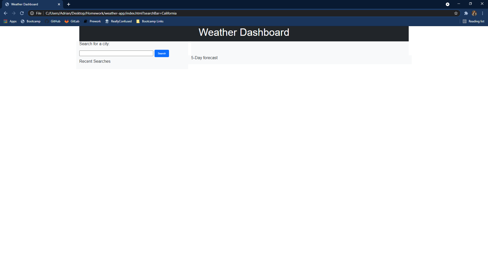
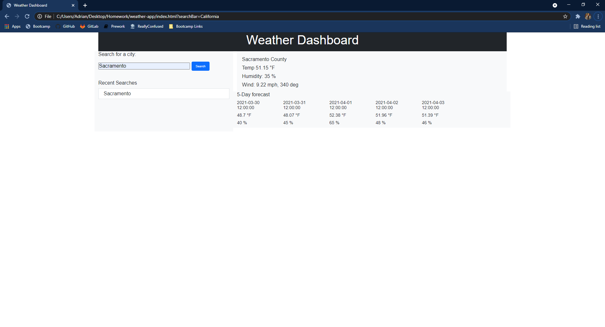
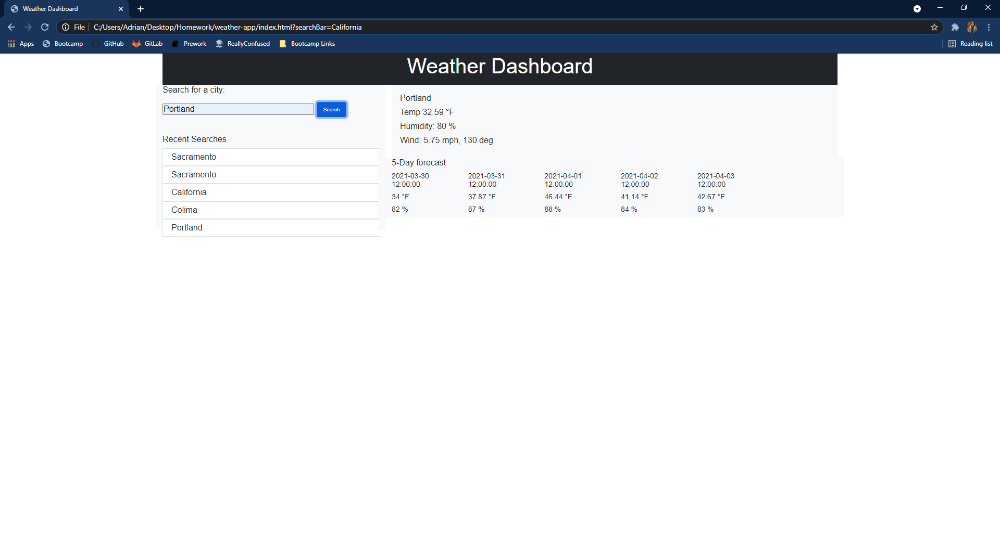

# weather-app

https://amata7.github.io/weather-app
https://github.com/amata7/weather-app

This is an application that uses a user search to find what the current weather in a city or state is, as well as the forecast for the next five days.

Currently the recent searches show up in a list as the user searches for them underneath the search bar as the rest of the page updates to display the weather information.

Each new search is shown in the list as the user searches for them. Clicking on these buttons will not update the weather dashboard as of yet.

--todo--
correctly show emojis on the 5-day forecast
have an exposure tag show correctly
